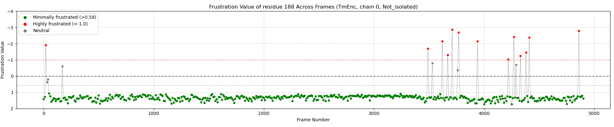

# FrustraMotion
FrustraMotion is a tool for the study of local energetic frustration of the dynamics states of proteins.
Is composed of 3 main scripts: 
- Frustration.py  
- Parser.py / Parser_contact.py  
- visualisation.py / visualisation_contact.py  
 
## Use of scrips

### Parser.py :
This script processes the directory containing frustration data and creates dataframes with the structure: frame × residues for single residue frustration data. It handles different modes of frustration calculation (isolated chains vs. complex).

#### Features:

- Processes single residue frustration data files in .done directories obtain by Frustration.py or directly by using FrsutratometeR 
- Handles three different modes:
 - Non-isolated mode (protein complex analyzed together)
 - Isolated mode (chains analyzed separately)
 - True isolated mode (single-chain protein)
- Creates organized CSV outputs with frustration indices for each residue across frames
- Automatically detects and handles multiple chains

#### Input File Requirements:

For non_isolate and True_isolate mode:
- Directory containing repertories with this structure: ProteinName_FrameNumber.done
- Inside each .done directory: FrustrationData/ProteinName_FrameNumber.pdb_singleresidue files

For isolated mode:
- Directory structure: ProteinName_FrameNumber_ChainName.done
- Inside each .done directory: FrustrationData/ProteinName_FrameNumber_ChainName.pdb_singleresidue files

#### Output:

- Creates CSV files with columns: chain, residue, frame0, frame10, etc.
with the frame column having the single_residue frustration indices (FI).
- Organizes output in subdirectories based on isolation mode:
 - `single_residue_dataframes/Not_isolated/` for complex analysis
 - `single_residue_dataframes/Isolated/` for chain-separated analysis
 - `single_residue_dataframes/True_isolated/` for single-chain proteins

#### Usage: 

1. Parse single_residue frustration data for protein complex, (directories named `ProteinName_FrameNumber.done`):
```bash
python3 Parser.py path/to/directory/
```
Generates output in `single_residue_dataframes/Not_isolated/ProteinName/` with one CSV per chain.

2. Parse the frustration data for a protein complex were the chain have been frustrated separetely, and directories have as code name `ProteinName_FrameNumber_ChainName.done`
```bash
python3 Parser.py path/to/directory/ --isolate
```
Generates output in `single_residue_dataframes/Isolated/ProteinName/` with one CSV per chain.

3. Parse the frustration data for a mono-chain protein, were directories have as code name `ProteinName_FrameNumber.done`
```bash
python3 Parser.py path/to/directory/ --true_isolate
```
Generates output in `single_residue_dataframes/True_isolated/ProteinName/` with one CSV per chain.


### Visualisation.py :
This script visualizes sigle_residue frustration data from the generated dataframes, providing various plotting options to analyze frustration patterns across residues, chains, and frames.

#### Features:
- Generates multiple types of visualizations:
  - Dot plots of frustration values for specific residues across frames
  - Multi-panel figures showing frustration for a residue across all chains
  - Boxplots showing frustration distribution:
    - Per residue across all chains at a specific frame
    - Per residue across all frames for a specific chain
- Color-codes frustration values based on classification:
  - Green: Minimally frustrated (>0.58)
  - Red: Highly frustrated (<-1.0)
  - Gray: Neutral (-1.0 to 0.58)
- Handles both single-chain and multi-chain protein data
- Can generate VMD visualization scripts for 3D viewing

#### Input Requirements:
- Directory containing frustration dataframes generated by Parser.py
- Dataframe files should be in CSV format with columns: chain, residue, frame0, frame10, etc.

1. **Residue Frustration Across Frames**:
   Plot frustration values for a specific residue across all frames.

   Example usage:
```bash
python3 Visualisation.py path/to/dataframes/ --residue 188 --chain 0
```



2. **Multi-Chain Residue Analysis**:
   Create multi-panel figure showing frustration for a residue across all chains.

   Example usage:
```bash
python3 Visualisation.py path/to/dataframes/ --residue 188
```
Output: Grid of plots showing frustration for residue 188 in each available chain.


3. **Frame-Specific Boxplot**:
   Show single_residue frustration distribution per residue across all chains at a specific frame.

   Example usage:
```bash
python3 Visualisation.py path/to/dataframes/ --boxplot --variability --frame 100 --residue 188
```
Output: Boxplot showing frustration distribution for each residue at frame 100, the boxplot of the residue 188 is highlighted in red.

4. **Dynamic Boxplot**:
   Show frustration distribution per residue across all frames for a specific chain.

   Example usage:
```bash
python3 Visualisation.py path/to/dataframes/ --boxplot --dynamic --chain A --residue 188
```
Output: Boxplot showing frustration distribution for each residue in chain 'A' across all frames, the boxplot of the residue 188 is highlighted in red.
 
5. **VMD Visualization Script Generation**:
   Generate TCL script for visualizing frustration in VMD.

   Example usage:
```bash
   python3 Visualisation.py path/to/dataframes/ --generate-tcl --pdb-dir path/to/pdbs/ --frame-step 10
```
Output: TCL script that can be run in VMD to visualize frustration patterns.
THIS have 2 optional settings
- --frame-step: Controls spacing between frames in VMD animation (default: 10)
- --max-frames: Limits number of frames included in VMD script


### Parser_contact.py 
This script processes contact frustration data, creating organized dataframes of contact frustration indices across frames and chains.

#### Features:
- Processes configurational frustration data for protein contacts .done directories obtain by Frustration.py or directly by using FrsutratometeR 
- Handles three calculation modes:
  - Non-isolated mode (protein complex analyzed together)
  - Isolated mode (chains analyzed separately)
  - True isolated mode (single-chain protein)
- Filters and processes specific chains when requested
- Generates comprehensive contact data with:
  - Residue pairs and their chain assignments
  - Frustration indices (FI)
  - Welltype and FrustState classifications
  - Frame information

#### Input Requirements:
For non-isolated and true-isolated modes:
- Directory containing repertories with this structure: ProteinName_FrameNumber.done
- Contact files: FrustrationData/ProteinName_FrameNumber.pdb_configurational files inside each .done directory

For isolated mode:
- Directory structure: ProteinName_FrameNumber_ChainName.done
- Contact files: FrustrationData/ProteinName_FrameNumber_ChainName.pdb_configurational inside each .done directory

#### Output:
- Creates CSV files with columns:
  - Res1/Res2: Residue numbers
  - ChainRes1/ChainRes2: Chain identifiers
  - AA1/AA2: Amino acid types
  - FrstIndex: Contact frustration index
  - Welltype: Contact well type
  - FrstState: Frustration state
  - Frame: Frame number
  - ResID1/ResID2: Combined chain:amino_acidresidue identifiers
  
- Organizes output in subdirectories:
  - `contact_dataframes/Not_isolated/` for complex analysis
  - `contact_dataframes/Isolated/` for chain-separated analysis
  - `contact_dataframes/True_isolated/` for single-chain proteins

1. Parse contact frustration for protein complex (directories named `ProteinName_FrameNumber.done`):
```bash
python3 Parser_contact.py path/to/directory/
```
Generates output in `contact_dataframes/Not_isolated/ProteinName/` with one CSV file containing all contacts.

2. Parse specific chains in a complex:
```bash
python3 Parser_contact.py path/to/directory/ --chains 0 5 l q v  
```
Processes only contacts involving the specified chains (0, 5, l, q, v).
Useffull is the memory is limited for parsing all the chains.

3. Parse the contact frustration data for a protein complex were the chain have been frustrated separetely (directories named `ProteinName_FrameNumber_ChainName.done`):
```bash
python3 Parser_contact.py path/to/directory/ --isolate
```
Generates output in `contact_dataframes/Isolated/ProteinName/` with separate CSV files for each chain.

4. Parse single-chain protein (directories named `ProteinName_FrameNumber.done`):
```bash
python3 Parser_contact.py path/to/directory/ --true_isolate
```
Generates output in `contact_dataframes/True_isolated/ProteinName/` with a single CSV file.

### visualisation_contact.py
This script analyzes and visualizes contact frustration data, from the generated dataframes with Parser_contact.py

#### Features:
- Generates comprehensive visualizations of contact frustration:
  - Evolution plots showing frustration indices across frames
  - Individual contact analysis for specific residue pairs
  
- Supports analysis of both intra-chain and inter-chain contacts
- Color-codes frustration values based on classification:
  - Red: Highly frustrated contacts (< -1.0)
  - Green: Minimally frustrated contacts (> 0.78) 
  - Gray: Neutral contacts (-1.0 to 0.78)
- Highlights specific frames of interest

#### Input Requirements:
- Directory containing contact dataframes generated by Parser_contact.py
- CSV files with columns:
  - ResID1/ResID2: Residue identifiers (Chain:AA+Number)
  - FrstIndex: Contact frustration index
  - Welltype: Contact type (short/long/water-mediated)
  - FrstState: Frustration classification
  - Frame: Frame number

#### Output:

- Generates multiple visualization files:
 - Main contact evolution plot (PNG)
 - Individual contact plots for each residue pair (in 'individual_contacts' subdirectory)
 - CSV file with detailed contact statistics
- Organizes output in directory structure:
 - `contact_analysis/Not_isolated/ProteinName/`
 - `contact_analysis/Isolated/ProteinName/`
 - `contact_analysis/True_isolated/ProteinName/`
 
1. **Contact Evolution Plot**:
   Shows frustration values for all contacts involving a specific residue across frames.

    Example usage:
```bash
python3 Visualisation_contact.py path/to/the/dataFrames/ --residue A:Y188
```
Output:
- Line plot showing frustration evolution for all contacts involving residue Y188 in chain A
- Different colors for each contact pair
- Size coding for contact types (short/long/water-mediated)
- Individual contact plots for each residue pair (in 'individual_contacts' subdirectory)

2. Specific Frame Analysis:
Focus on particular frames of interest.

Example usage:
```bash
python3 Visualisation_contact.py path/to/the/dataFrames/ --residue A:Y188 --frames 0 100 1500
```
Output: Plot showing contact frustration only at frames 0, 100, and 1500

3. Contact Type Filtering:
Analyze only specific types of contacts.

Intra-chain contacts only:
```bash
python3 Visualisation_contact.py path/to/the/dataFrames/ --residue A:Y188 --only-intra
```

Inter-chain contacts only:
```bash
python3 Visualisation_contact.py path/to/the/dataFrames/ --residue A:Y188 --only-inter
```
